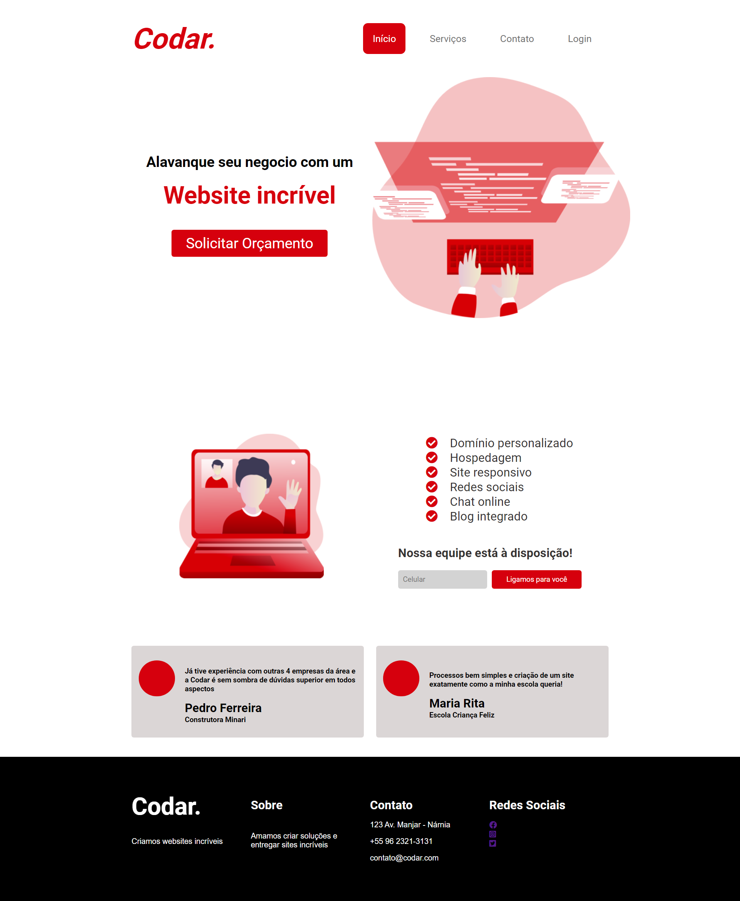
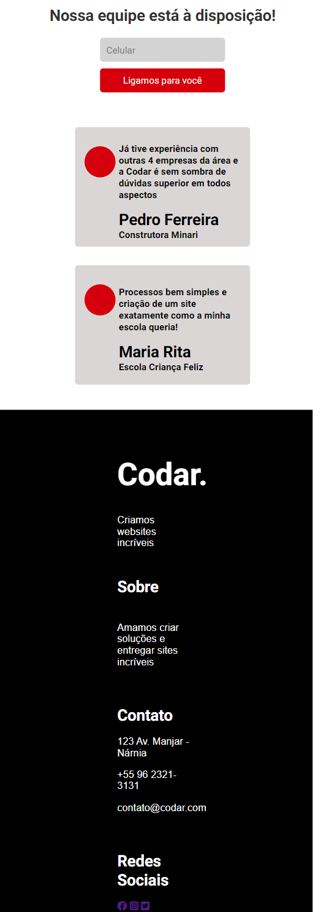

<h1 align="center">
    Website CODAR.
</h1>

<h1 align="center">
    
</h1>

<h1 align="center">
    
    
</h1>

## 🚩About
A simple website using HTML and CSS with flexbox concepts. I found this project design on [DevChallanges](https://devchallenge.now.sh/challenges/5ed47992adee277fae224a0b/details) and decide to build just for fun and pratice.
